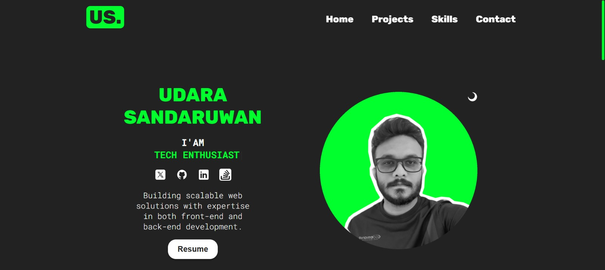
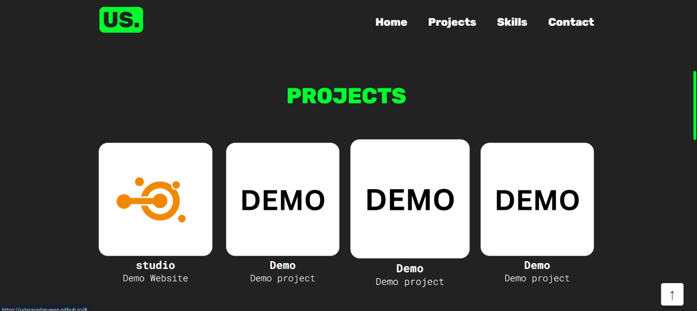
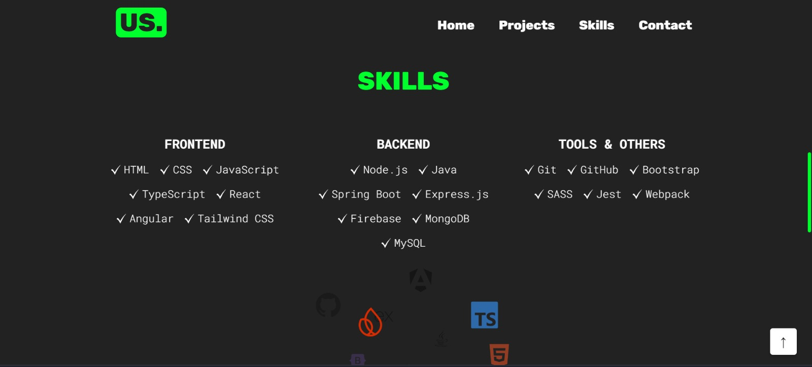
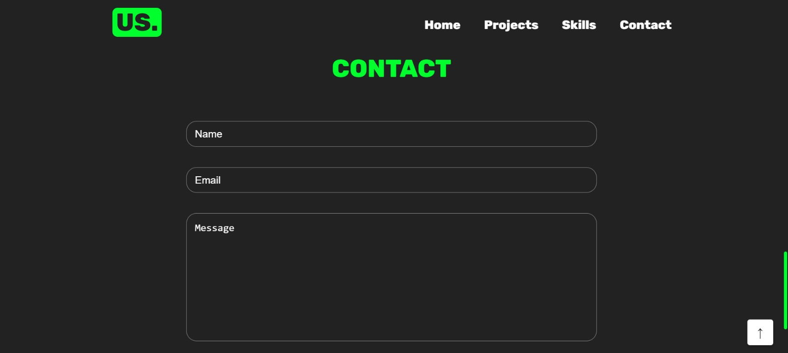

# Portfolio Website

A responsive and interactive portfolio website built using **React** and **Vite**. This project showcases my skills, projects, and ways to contact me. It includes modern animations and a clean UI for a seamless user experience.

## Live
https://udarasadaruwan.github.io/

## Features

- **Responsive Design:** Fully functional across devices of all screen sizes.
- **Interactive Animations:** Smooth transitions using the `react-intersection-observer` library.
- **Sections:**
  - Hero section with an engaging introduction.
  - Projects showcase with detailed descriptions.
  - Skills section to highlight technical abilities.
  - Contact form for easy communication.

## Tech Stack

- **Frontend Framework:** React with Vite for fast development.
- **Styling:** Custom CSS for styling components.
- **Utilities:** `react-intersection-observer` for animations on scroll.

## Preview

Here are screenshots of the portfolio site:

### Hero Section


### Projects Section


### Skills Section


### Contact Section



## Installation and Setup

To run the project locally, follow these steps:

1. **Clone the repository**:
   ```bash
   git clone https://github.com/your-username/your-portfolio.git
   cd your-portfolio

2. **Install dependencies**:
   ```bash
   npm install

3. **Start the development server**:
   ```bash
   npm run dev

## Contributing
Contributions, issues, and feature requests are welcome! Feel free to fork the repository and create a pull request.

## License
This project is open-source and available under the MIT License.